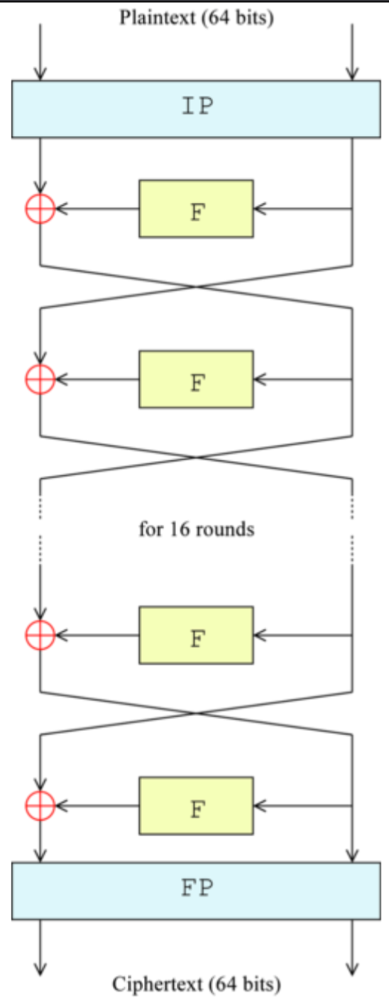
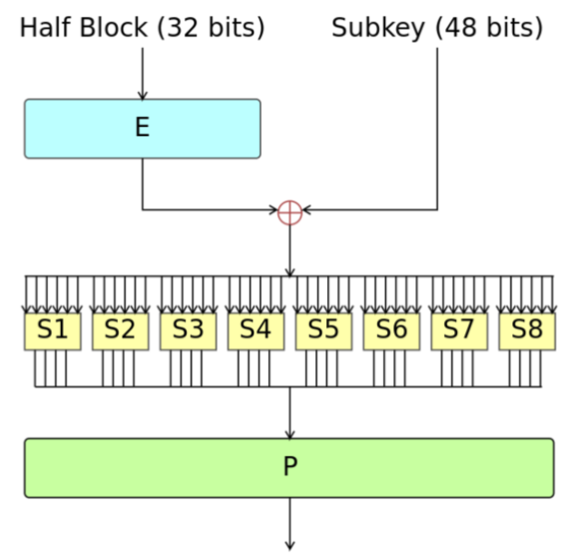
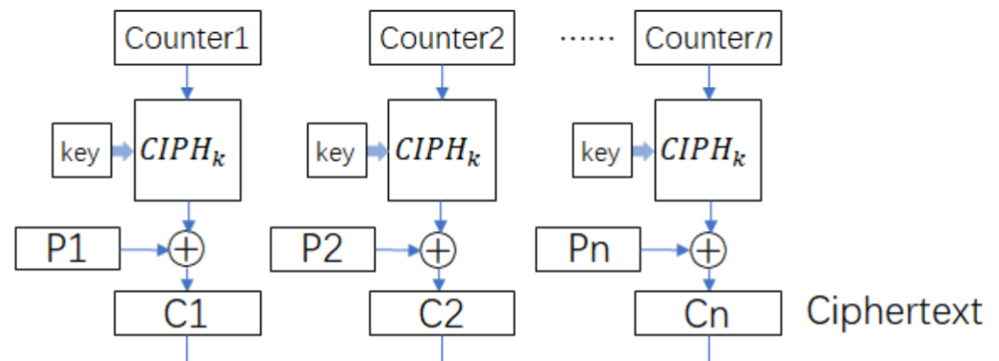

# Symmetric (secret-key) cryptography

What a crypto-system is (the three algorithms) You can describe DES or AES - but you can also just give a high-level description of what a block cipher is. Definitions of PRF and CPA security. Specification of CBC or CTR modes (or both), proofs of CPA security for CBC or CTR mode (or both). Perhaps a brief talk about stream ciphers and how to make one from a block cipher.

## Core Vocabulary & Syntax (Total Recall)

### Cryptosystem

> A cryptosystem is a triple $(G,E,D)$ of algorithms, for key generation, encryption and decryption.
> The definition says nothing about security.

> For a cryptosystem, we always require that for any key $K$ output by $G$, correct decryption is possible,
> i.e. it holds that for any $x \in P$, $x = D_K(E_K(x))$.  
> The simplest cryptosystem system ”encrypts” by sending x itself.

> For symmetric cryptosystems, the information you need to encrypt a message is the same as what you need to decrypt it.

#### $G$ (Key Generation)

> This algorithm is probabilistic, takes no input and always outputs a key $K \in \mathscr{K}$,
> usually $G$ simply outputs a key chosen uniformly from $\mathscr{K}$.

#### $E$ (Encryption)

> This algorithm takes as input $K$ and $x \in \mathscr{P}$ and produces as output $E_K(x) \in \mathscr{C}$.

> Note that $E$ **may be probabilistic**; even for a given $x_0$ and $K_0$, many different ciphertexts may be produced as output from $E$ as a result of random choices made during the encryption process.
> In other words, the ciphertext will have a probability distribution that is determined from $x$ and $K$, typically uniform in some subset of the ciphertexts.

#### $D$ (Decryption)

> This algorithm takes as input $K$, $y \in C$ and produces as output $D_K(y) \in \mathscr{P}$.
> It is (not strictly, but) most often deterministic.

### Block cipher

> Cryptosystem, where the key is a bit string of fixed length and key generation just chooses a uniform key.
> Furthermore, it takes as input a bitstring of fixed length and outputs a ciphertext of the same length.

### Feistel ciphers

> Named after Horst Feistel, who was on the IBM team that designed DES, a Feistel cipher is a symmetric block cipher design model that processes plaintext through multiple rounds of substitution and permutation operations.

> They have the following structure: encryption consists of repeating some computation a number of times, one such computation is called a round, and the number of rounds is denoted $n$.
> There is an algorithm called the Key Schedule that takes the key as input and outputs the rounds keys $K_1,...,K_n$, where each round uses its own round key.
> More concretely, each round does the following: 
> The input is a bitstring $P$ that we **split in two halves**, called $L_0, R_0$. 
> Then for $i = 1 \dots n−1$ we, for a given **round function** $f$ do: $L_i = R_{i−1}, R_i = L_{i−1} \oplus f(R_{i−1},K_i)$. 
> The last round is slightly different: we set $R_n = R_{n−1}, L_n = L_{n−1} \oplus f(R_{n−1},K_n)$. 
> The output ciphertext $C$ is now defined to be $C = (L_n, R_n)$. 
> It is not hard to see that if you know the round key $K_i$, you can invert the $i$’th round:
> given $L_i$, $R_i$, you can compute $L_{i−1} = R_i \oplus f(L_i,K_i)$, $R_{i−1} = L_i$,
> and so given the key, one can always decrypt a Feistel cipher. 
> Note that this works no matter what the function $f$ does, so this means that one can design $f$ to get the most secure cipher possible, without having other constraints in mind.
> For instance $f$ doesn't have to be invertible.

> The structure illustrated specifically for DES 
> 

### DES

> Data Encryption Standard (DES) is a symmetric block cipher that encrypts data in fixed-size blocks using the Feistel structure.
> It has been deprecated and AES took its place in 2001
> It takes a 64-bit input block and a 56-bit secret key to produce a 64-bit ciphertext.

> At a high level, DES works as follows: 
> - The 64-bit plaintext is permuted and then split into two 32-bit halves, $L_0$ and $R_0$.
> - DES applies 16 Feistel rounds, where the round function $f(R,K) = P(S(K \oplus E(R)))$, using functions $E$, $S$, $P$.
>   - $E(R)$ expands the 32-bit right half to 48 bits
>   - $K \oplus \dots$ mixes it with the subkey
>   - $S(\dots)$ passes it through nonlinear S-boxes reducing the length back to 32 bits [LUT that for each 6 bits gives a 4 bit chunk which are then concatenated]
>   - and $P(\dots)$ permutes the result according to the specification.
> - After the 16th round, the two halves are swapped and a final permutation produces the 64-bit ciphertext block.

> Decryption runs the **same** Feistel network but uses the subkeys in reverse order, so DES encryption and decryption share the same core structure.
> Intuitively, DES is “just” a 16-round Feistel cipher with carefully chosen bit permutations and S-boxes to resist classical attacks, though its 56-bit key is small by modern standards.

> 

### PRF Security

> We imagine that for a good cryptosystem, an adversary couldn't really differentiate between the encryption of a given message and completely random output of the same format.
> This would mean our cryptosystem works like a pseudorandom function.

> Let's put this into numbers for a function $f_K$, where $K \in {\{0,1\}}^k$, $f_K : {\{0,1\}}^n \rarr {\{0,1\}}^m$.
> Let's say an adversary ($A$, a probabilistic function) is blindly presented with one of 2 oracles (~black-box functions): 
> **The ideal world**: $A$ gets access to an oracle $O_{Ideal}$ which initially
> chooses a random mapping $R$ from ${\{0,1\}}^n$ to ${\{0,1\}}^m$ (uniformly among all such mappings),
> and then, when $A$ sends an input x, it answers with $R(x)$. 
> **The real world**: The adversary gets access to an oracle $O_{Real}$ which initially
> chooses $K$ at random from ${\{0,1\}}^k$, and fixes $K$ for the duration of the game.
> After this, on input $x$, it answers with $f_K(x)$.

> The adversary needs to then guess which oracle it encountered by outputting a bit.
> Define $p(A, 0) := \text{ guessed ideal}$ anf $p(A, 1) := \text{ guessed real}$.
> The advantage of $A$ is then ${Adv}_A(O_{ideal}, O_{real}) = |p(A,0) − p(A,1)|$.

> We say that $f_K$ is a $(t, q, \varepsilon)$ PRF-secure, if any adversary $A$ that runs in time at most $t$ and makes at most $q$ calls to the oracle, satisfies ${Adv}_A(O_{Real},O_{Ideal}) \leq \varepsilon$.

### CPA Security

> Deterministic block cyphers have a very clear problem: if I encrypt $m$ today and tomorrow, I'll get the same result.
> This is giving away too much information to an attacker.

> PRF security is nice and dandy, but it doesn't take this weakness into account - let's define something stronger.
> Let's require the adversary that it cannot tell the difference between a real encryption of **a message $x$ it chooses**, and a completely random ciphertext chosen with no relation to $x$!
> Note that this doesn't hold for DES; $A$ could submit $x$ multiple times and could be reasonably sure that if they got back the same thing they are dealing with the real deal, otherwise they are in the ideal world.

> **The ideal world**: $A$ gets access to an oracle $O_{Ideal}$ which on input a plaintext $x$ answers with $E_K(r)$, where $r$ is a randomly chosen message with the same length as $x$, and $K$ is produced by $G$, but fixed in the entire attack. 
> **The real world**: $A$ gets a access to normal chosen message attack: an oracle $O_{Real}$ which on input a plaintext $x$ answers with $E_K(x)$, where $K$ is produced by $G$, but fixed in the entire attack.

> The cryptosystem $(G,E,D)$ is $(t, q, \mu, \varepsilon)$ CPA-secure,
> if for any adversary $A$ that runs in time at most $t$,
> and makes at most $q$ calls to the oracle,
> with plaintexts consisting of a total of μ bits,
> it holds that ${Adv}_A(O_{Real},O_{Ideal}) \leq \varepsilon$.

### CTR mode and proof for its CPA security 

> PRF-secure block cyphers can be converted into probabilistic, CPA-secure cryptosystems that as a bonus benefit can handle any length.
> These are often called *modes of use*, and one of these is the CTR (Counter) mode.

> The trick is to create a random initialization vector $IV$ or nonce of length $n$ (block size).
> Then split the message up into $n$ bit chunks.
> Encrypt $IV$ with the key $K$, then XOR the result to the first block.
> Then increase $IV$ by one, encrypt it and XOR the next block.
> The result is $[IV, m_1 \oplus E_K(IV), m_2 \oplus E_K(IV + 1) \dots]$ (where the square brackets denote the concatenation of bits).
> Decryption is rather trivial.

> Suppose $\{E'_K \mid K \in \mathscr{K}\}$ is $(t', q', \varepsilon')$ PRF-secure.
> Then CTR encryption based on this system is $(t, q, \mu, \varepsilon)$ CPA-secure for any $q$, and for
> $$t \leq t' \quad \frac{\mu}{n} \leq q' \quad \varepsilon = \varepsilon' + \left(\frac{\mu}{n}\right)^2 \cdot \frac{1}{2^n}$$

> TODO proof of CPA sec

### Stream Cipher from CTR block cipher

> Trivial

## Logic Flow / Mechanism (Process)

**Construct a symmetric cryptosystem (G, E, D). Fill in the requirements and correctness condition.**

1. Define finite sets: **K**, **P**, **C**.
2. [____________________]
3. [____________________]
4. Require: For any $ K $ from **G**, and any $ x \in P $, $ x = D_K(E_K(x)) $.

**Encrypt a message with the Shift Cipher. Derive the steps.**

1. Choose $ K $ uniformly from $ K = \mathbb{Z}_n $.
2. [____________________]
3. [____________________]

## The "Exam Trap" (Distinctions)

**Distinguish between attack models based on oracle access. Complete the matrix:**

| Attack Type                | Oracle Input    | Oracle Output   | Adversary Knowledge |
| -------------------------- | --------------- | --------------- | ------------------- |
| **Ciphertext Only**        | [Student fills] | [Student fills] | [Student fills]     |
| **Known Plaintext**        | [Student fills] | [Student fills] | [Student fills]     |
| **Chosen Plaintext (CPA)** | [Student fills] | [Student fills] | [Student fills]     |
| **Chosen Ciphertext**      | [Student fills] | [Student fills] | [Student fills]     |

## Exam Simulation

**Oral Exam Question 1:** "Walk me through the definition of a symmetric cryptosystem, including the three algorithms and their inputs/outputs. Specify the sets involved and the correctness requirement."

**Oral Exam Question 2:** "Describe DES and AES as modern symmetric cryptosystems. What historical context led to DES, and why was a successor like AES needed? Reference their structure (e.g., Feistel for DES)."

**Oral Exam Question 3:** "Source data missing for PRF definition, CPA security definitions, CBC/CTR mode specifications, and their CPA security proofs. Explain from course material: Define PRF and CPA security. Specify CBC or CTR mode and prove its CPA security assuming a secure block cipher."

## Source Map

- [CryptographyV6.pdf](../../subjects/Cryptology/sources/CryptographyV6.pdf) | Page 27-28 | Covers: Symmetric cryptosystem definition (G, E, D), sets K/P/C, correctness.
- [CryptographyV6.pdf](../../subjects/Cryptology/sources/CryptographyV6.pdf) | Page 28 | Covers: Shift Cipher example.
- [CryptographyV6.pdf](../../subjects/Cryptology/sources/CryptographyV6.pdf) | Page 29 | Covers: Attack models (ciphertext-only, known/chosen plaintext/ciphertext).
- [CryptographyV6.pdf](../../subjects/Cryptology/sources/CryptographyV6.pdf) | Page 60-61 | Covers: DES blockcipher, Feistel structure, history.
- [CryptographyV6.pdf](../../subjects/Cryptology/sources/CryptographyV6.pdf) | Page 58,63 | Covers: DES and AES blockciphers (high-level).